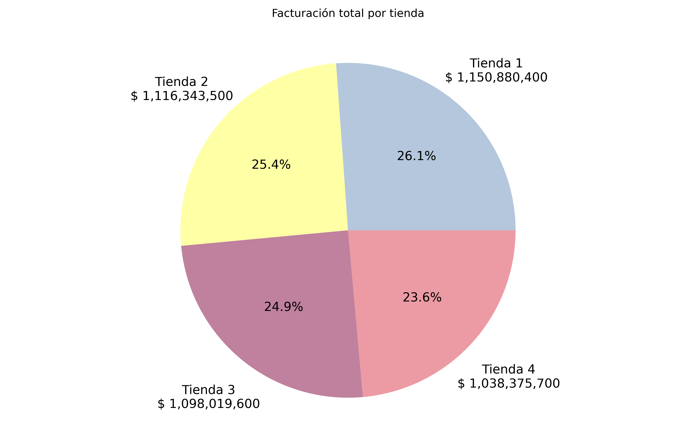
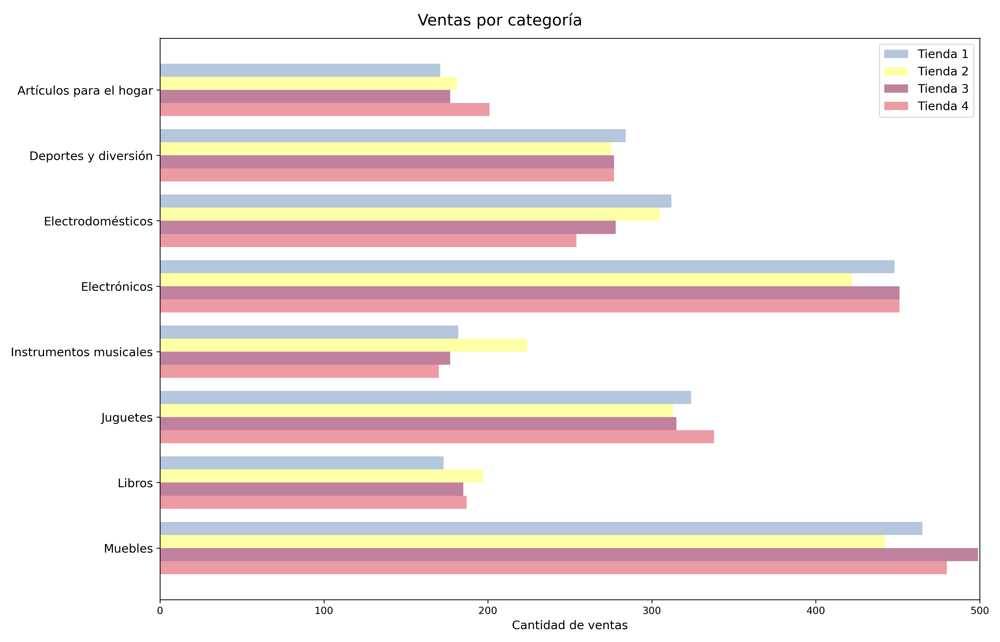
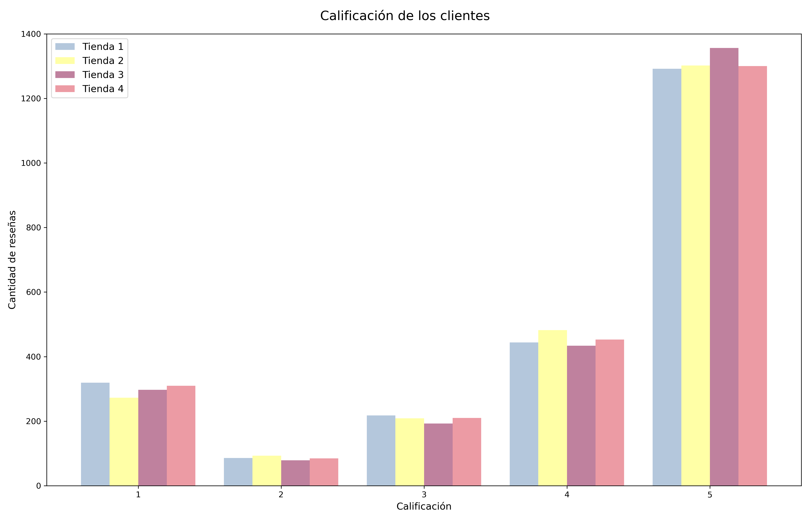
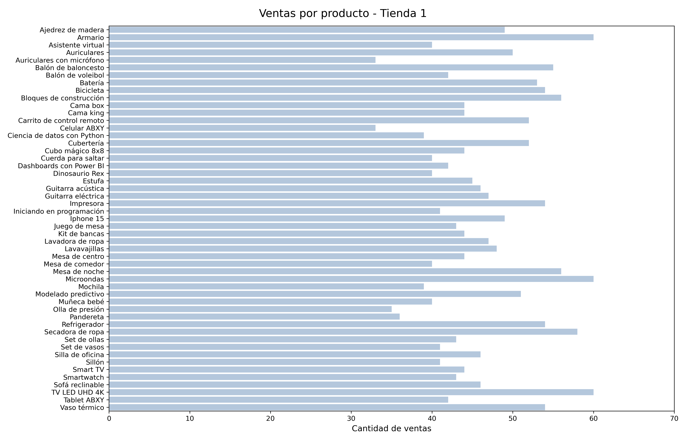
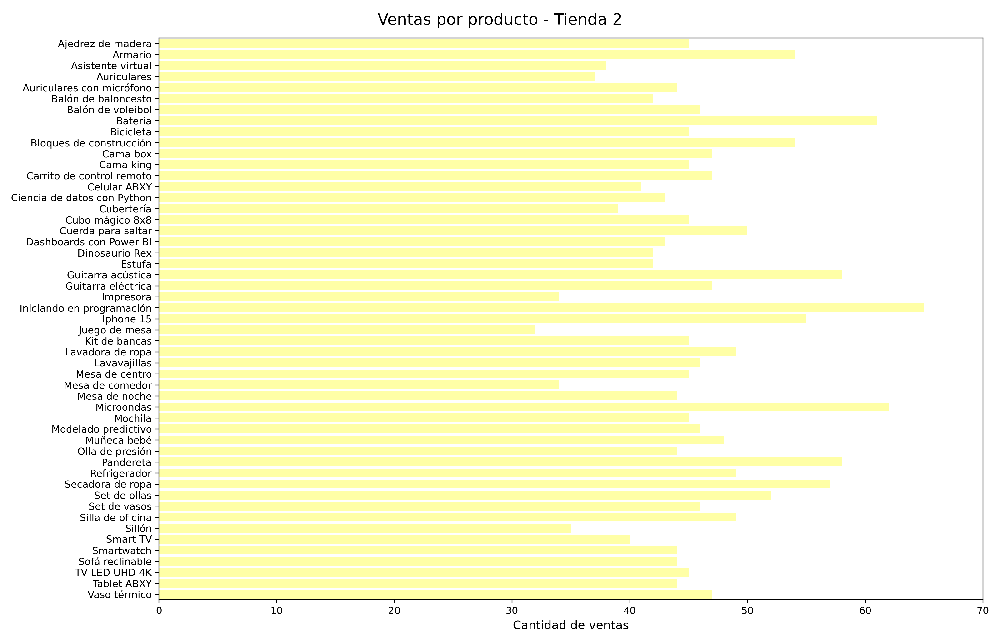
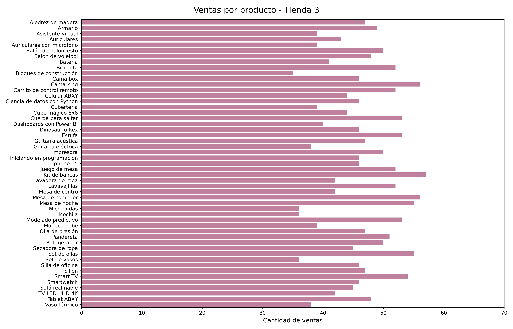
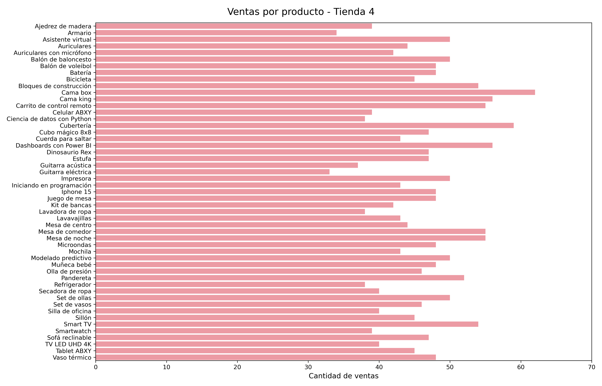
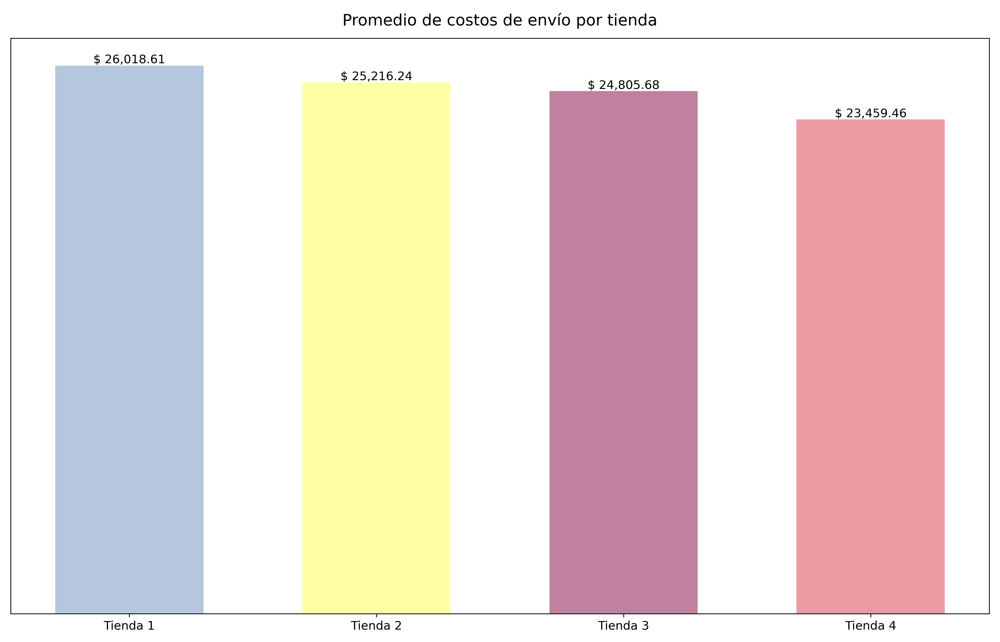

# Challenge: Alura Stores

Análisis de datos comerciales para la toma de decisiones estratégicas.

 

## Escenario

El señor Juan nos ha contratado para analizar la información de ventas de sus cuatro tiendas, con el fin de tomar una decisión informada sobre **cuál tienda debería venderse** para poder invertir en un nuevo negocio.

 

## Metodología

El estudio se basó en los siguientes indicadores clave:

* Ingreso total por tienda.
* Categorías de producto más populares.
* Promedio de calificación de los clientes.
* Productos con mayor volumen de ventas.
* Costo promedio de envío.

 

## Resultados

### Ingreso total por tienda

Cada una de las cuatro tiendas presenta un volumen de ingreso muy similar, aunque **la diferencia entre las tiendas de mayor y menor venta es de $ 112,504,700** (9.8% respecto de la tienda con mayor ingreso y 2.6% respecto de las ventas totales).

### Categorías de producto más populares

Se aprecia que las categorías de mayor venta son:

1. Muebles
2. Electrónicos
3. Juguetes

Esta tendencia es constante entre todas las tiendas. Sin embargo, **la Tienda 2 muestra un menor volumen de ventas en las tres categorías**.

### Promedio de calificaciones

Al igual que en los dos apartados anteriores, la distribución de calificaciones de clientes muestra una tendencia muy similar entre las cuatro tiendas. No obstante, **la Tienda 1 es la que cuenta con mayor cantidad de calificaciones de 1 estrella**, mientras que **la Tienda 3 es la que ostenta la mayor cantidad de reseñas de 5 estrellas**.

|Tienda|⭐|⭐⭐|⭐⭐⭐|⭐⭐⭐⭐|⭐⭐⭐⭐⭐|
|:---|:---:|:---:|:---:|:---:|:---:|
|Tienda 1|319|86|218|444|1292|
|Tienda 2|273|93|209|482|1302  
|Tienda 3|297|79|193|434|1356|
|Tienda 4|310|85|210|453|1300|

### Productos más vendidos

A continuación se presentan gráficamente las ventas de todos los productos en las tiendas.

Los resultados presentados muestran una tendencia congruente con las categorías de mayor venta entre las cuatro tiendas, aunque no necesariamente esto se ve reflejado en el producto de mayor venta en cada tienda:

|Tienda|Producto de mayor venta|Categoría|
|:---|:---:|:---:|
|Tienda 1|Microondas|Electrodomésticos|
|Tienda 2|Iniciando en programación|Libros|
|Tienda 3|Kit de bancas|Muebles|
|Tienda 4|Cama box|Muebles|

### Costo promedio de envío

El costo promedio de envío por cada producto impacta directamente en el ingreso por cada venta, así como la calificación final otorgada por el cliente, con base en el tiempo de entrega y el estado del producto (p.ej., el estado del embalaje del producto).

De la gráfica anterior, se desprende que el costo promedio de envío por producto disminuye con respecto a la tienda. Esto sugiere que **la Tienda 1 es geográficamente la más lejana de los clientes, o al ser la más antigua, es la que cuenta con los costos de envío menos optimizados**.

 

## Conclusiones

Tomando en cuenta los factores arriba enlistados, se contemplan varios aspectos sobre las cuales el señor Juan puede tomar una decisión.

Primero, el volumen bruto de ventas. Entre más antigua es la tienda, su volumen de ventas es mayor (la Tienda 1 es la de mayor facturación), de tal forma que vender la Tienda 4 supondría la menor pérdida posible.

Segundo, las categorías de los productos de mayor venta en todo el sistema. En este rubro, la Tienda 2 es la de menor venta en las tres dichas categorías: muebles, electrónicos y juguetes.

Tercero, la opinión general de los clientes y el costo de envío. Es natural que, al arrancar el negocio, los clientes no estén del todo satisfechos con los servicios prestados. Esta tendencia puede mejorar con el paso del tiempo mediante la mejora en la calidad de los productos, la facilidad y/o agilidad con la que se lleva a cabo el proceso de compra, y la optimización de los servicios de transporte. Es claro que la Tienda 4 es la que tiene el menor costo promedio de envío, aunque la menor calificación promedio de los clientes corresponde a la Tienda 1. Tampoco se puede dejar de considerar un dato importante: el costo promedio de envío de la Tienda 2 se encuentra prácticamente en la media entre aquellos de las Tiendas 1 y 3.

Por todo lo anterior, la opinión final es que:

### El señor Juan debería vender la Tienda 2.

Esto por las siguientes razones:

1. Su aportación es muy equilibrada (25.4% del total de facturación), por lo que venderla no supondrá un impacto mayor en el ingreso.
2. Tiene la menor cantidad de ventas en las tres categorías de producto más vendidas en todo el sistema.
3. A pesar de tener la menor cantidad de reseñas negativas de los clientes, su calificación promedio es muy competitiva (segundo lugar).
4. El costo promedio de envío es muy similar a la media entre las cuatro tiendas.

Finalmente, se debe tomar en cuenta que todo lo anterior es una recomendación efectuada con base en el análisis ya presentado, ya que la decisión final corresponde al señor Juan exclusivamente.
